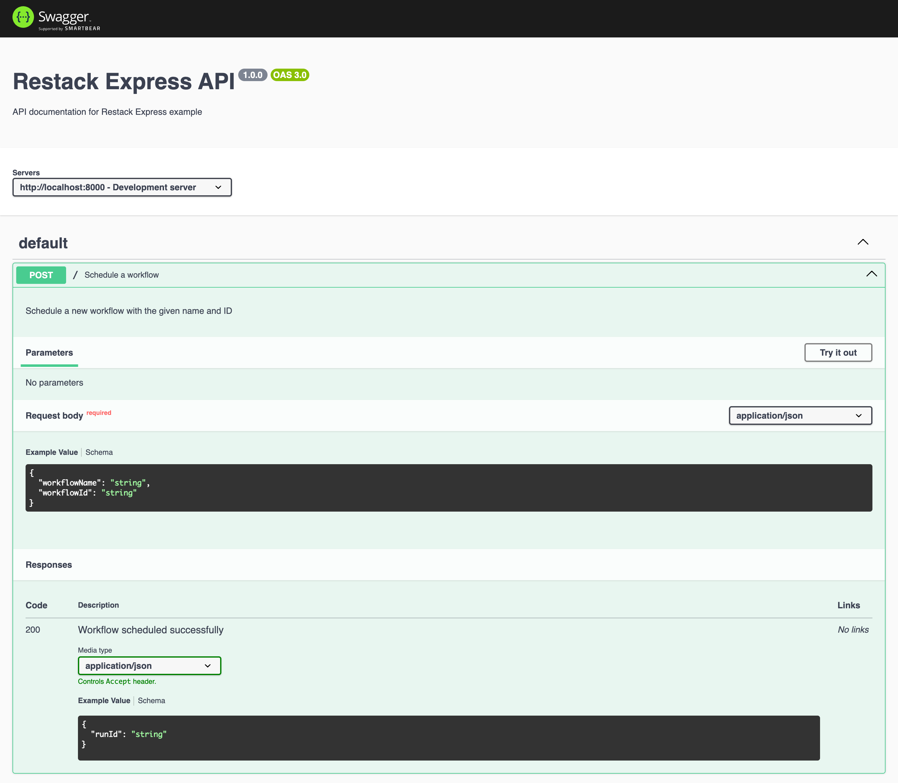

# Run Restack in Docker

docker run -d --pull always --name restack -p 5233:5233 -p 6233:6233 -p 7233:7233 ghcr.io/restackio/restack:main

# Open the Desktop UI

http://localhost:5233

# Install dependencies

```
pnpm i
```

## Run the Express server

```
pnpm dev
```

The server should be up at http://localhost:8000
The Swagger documentation is available at http://localhost:8000/api-docs




## Send a test request to the server from Swagger UI

Navigate to http://localhost:8000/api-docs in your browser to access the Swagger UI.

You can test the API endpoints directly from the UI by clicking on the POST endpoint and using the "Try it out" button.

## Build and Run Docker Container

Build the Docker image of the server incl. Swagger UI and run the container with:

```
pnpm docker:dev
```

## Deploy on Restack Cloud

To deploy the application on Restack, you can create an account at [Restack Console](https://console.restack.io)
